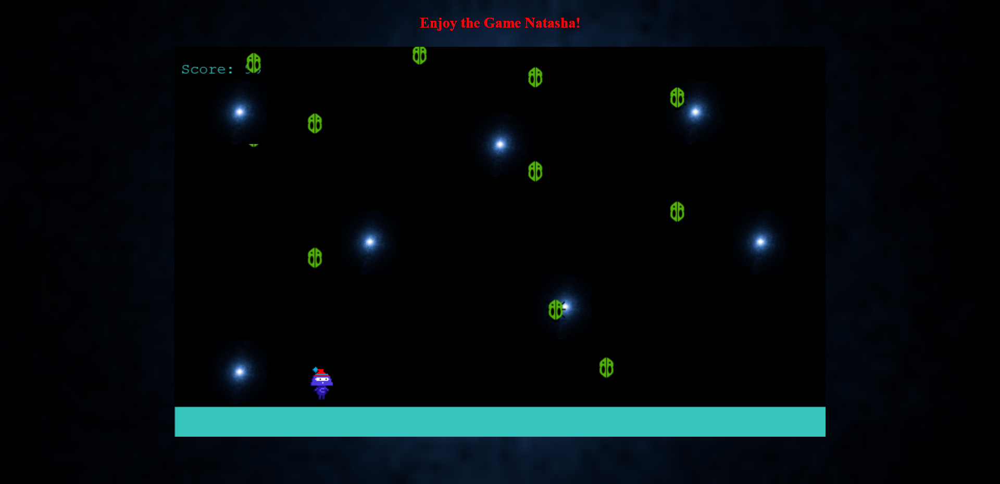

# Javascript capstone project: Bug Dodger

This is a phaser 3 game built as a Microverse Capstone ( Module Completion ) project.

Kindly check the Game Design Document I made before starting out: [GDD](./gdd.md)

## What is this project about? 

This game consists of three levels all of which you need to dodge all the falling bugs for as long as you can to get more points. The rate at which the bugs come out increases at each level. Players are required to enter their name in the input field so the system can update the LeaderBoard. It takes a few minutes before the leaderboard scene gets updated, so you do need to refresh your browser tab to view the updated leaderboard.

## Built with: 
- HTML5
- [Phaser 3](https://phaser.io/phaser3)
- Vanilla JavaScript

### Tools

- [npm](https://www.npmjs.com/)
- [Jest](https://jestjs.io/es-ES/)
- [ESlint](https://eslint.org/)
- [Webpack](https://webpack.js.org/)
- StyleLint

**Instructions**

The player can:
- Move left & right to avoid bumping into the falling bugs.
* The score increases by 10 each time a bug hits the ground.

## Live demo link

[The Bug Dodger](https://space-survivor.netlify.app/)

## How to use this app locally?

**Pre-requisites**

- Having [NodeJS](https://nodejs.org/en/) installed on your machine.

### Setting up instructions 

**In case you use Git**

1. Open terminal 

2. Run the following commands:

`git clone https://github.com/ClaytonSiby/Phaser3-JS-Capstone.git`

`cd Phaser3-JS-Capstone`

`yarn install`

3. Run `yarn start` to start the webdev-server.

**In case you don't use a version control system**

1. Go to [the repository](https://github.com/ClaytonSiby/Phaser3-JS-Capstone.git)

2. Press the green button that says "Code".

3. Press "Download zip".

4. Once downloaded, extract the files.

5. Right click on the folder, press "Open in terminal".

6. Run:

`yarn install`

7. Run `yarn start` to view the page on the local webdev-server.

### Running tests
 
1. Open terminal

2. Run:

`yarn test`

## Author 

👤 **Clayton Siby**
​

- Github: [@ClaytonSiby](https://github.com/ClaytonSiby)
   
- Linkedin: [Linkedin Profile](https://www.linkedin.com/in/clayton-siby-48a8a0183/)

- Twitter: [@Twitter](https://twitter.com/ClaytonSiby)

## :handshake: Contributing 

* Contributions, issues and feature requests are welcome! Feel free to check the [issues page](https://github.com/ClaytonSiby/Phaser3-JS-Capstone.git/issues)
- To contribute to this project:
- Fork this repository & clone locally.
- Create an upstream remote and sync your local copy.
- Create a new branch.
- Push your code to your origin repository.
- Create a new Pull Request .

## Show your support

Give a ⭐️ if you like this project!
​

## Acknowledgments

- [Microverse Training School](https://www.microverse.org/).
- [StackOverFlow](http://stackoverflow.com/)
- [W3Schools](https://www.w3schools.com/)