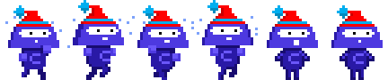

# The Game Design Document:
This my JavaScript capstone project that I developed using the Phaser 3 framework & vanilla JavaScript. 

# About Game

The main objective of the game is to dodge the falling bugs for as long as you can to earn more points. There are three levels to this game, two in which the speed rate of the falling bugs increases to make the level a little difficult & exciting. If player bumps into a bug, then it's game over & they have an option to retry the game.

 

- To depict player movements, I made use of the phaser 3's animation feature & a spritesheet

- The background changes at each level to let the player know that they are now on a different level.
- At each level, we add one more type of bug & increase the speed at which they fall in.

# Player Rules
- On the first page, users are required to enter their name in the input field & proceed to the main menu page.
- On the menu page users can either start the game right away or view the leaderboard.
- Opting on 'View LeaderBoard' option will take the user to the leaderboard page which displays the game's top 5 players & their scores.
- If on the main menu page, the user opt to 'Play Game', they will be taken to level One of the game, right away.
- Move left & right to dodge the bugs using the keyboard left & right arrows respectively.
- The score increases as the bugs hit the ground.

# Steps Taken In the Development of The Game
As someone who is new to the Phaser framework & game development, it took me more time to build this project hence overlaping the time limit for this game. The project is required to take 5 working days to complete but it took me 5 more days to build & get everything working as expected. I would like to appologise for that.

## This is the structure for each development stage:
- Stage 1: Watch & follow introductory along tutorials to the phaser game development framework => ( 2 days )
- Stage 2: Project Setup ( webpack, eslint, stylelint configurations ) => ( 1 days )
- Stage 3: Game Design & Research => ( 1 day )
- Stage 4: Gather assets for the game ( spritesheets, audio, images etc ) => ( 1 day )
- Stage 5: Build the core Game Scenes => ( 2 days )
- Stage 6: Add Scoring System, API calls and Testing => ( 1 day )
- Stage 7: Readme.md & gdd.md documentation & project deployment ( half a day)

# Acknowledgements
Microverse is the main inspiration behind the development of this game, I built it as the capstone project completing the JavaScript module of the [Microverse Main Technical Curriculum](https://microverse.org/). I would like to thank [OpenGameArt](https://opengameart.org/) for providing the free assets ( images, spritesheets, audio ) used in the development of this game. I also took some ideas for the game from [CodeAcademy](https://codeacademy.com/).
